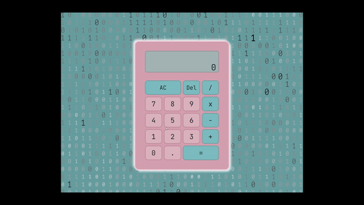
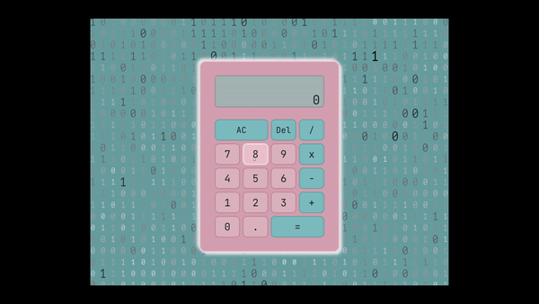

# Colourful Calculations!
A custom built calculator using HTML, CSS and JavaScript. Part of The Odin Project Foundations Course.

Click to [Calculate!](https://capetownkimmy.github.io/Colourful-Calculations/)

### The Project Objectives:
* Build a basic calculator that can execute basic mathematical equations correctly.
* Use Git version control.
* Use the comand Line.
* Develop locally on your computer.

---
## Features:

* Interactive and colourful UI.
* Mouse and keyboard support.
* Can work with decimals and round them appropriately.
* Clear All function for resetting.
* Delete function to remove one digit at a time for small errors.
* A display message if a user tries to divide by 0.

---
## Project Images:

## Software & Skills:

* 
* 
* 
* 
* 
* 
* 

#

###### Badges from **Simply Badges** 